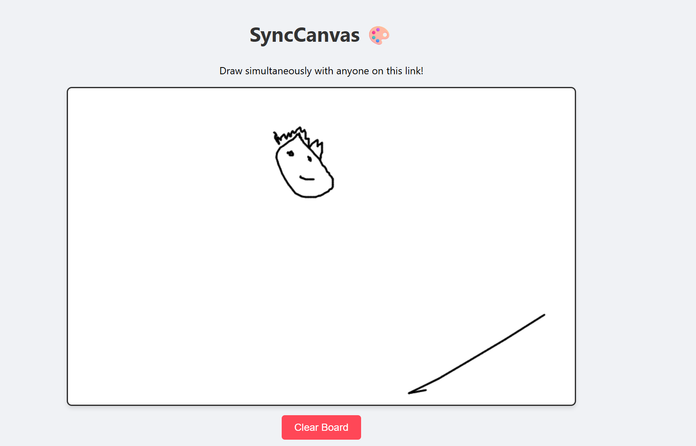

# 🎨 SyncCanvas — Real-Time Collaborative Whiteboard

A shared whiteboard for the browser. Everyone on the same link draws on the same
canvas, and strokes appear on every other device as they happen.

I built it to solve a small, real problem: explaining diagrams to friends while
studying remotely, without screen-sharing a drawing app.



> **Live demo:** _add your deployed URL here_

<details>
<summary>Screenshots to capture</summary>

Screenshots are the first thing anyone skimming this repo will look at, so they
are worth getting right:

- [ ] **Replace `demo.png`** — it still shows the previous single-button UI,
      not the current toolbar.
- [ ] Two browser windows side by side, mid-stroke, showing live sync
- [ ] The board on a phone, showing the wrapped toolbar and touch drawing
- [ ] A short GIF of a stroke appearing on a second client

Drop them in a `docs/` folder and link them here.

</details>

---

## ✨ Features

- **Real-time sync** — strokes are relayed over WebSockets and land on every
  connected client immediately.
- **Late joiners see the board** — the server keeps a capped in-memory history
  and replays it on connect, so arriving second doesn't mean arriving to a blank
  canvas.
- **Resolution-independent** — coordinates travel as fractions of the board
  rather than pixels, so a phone and a 4K monitor stay in agreement.
- **Real touch and stylus support** — one Pointer Events path covers mouse,
  touch and pen, with pointer capture so a stroke survives leaving the canvas.
- **Drawing tools** — six-colour palette plus a custom picker, adjustable brush
  size, and an eraser.
- **Export** — save the current board as a PNG.
- **Connection awareness** — a live/offline indicator and a count of who else is
  drawing, so a downed backend never looks like a quiet room.
- **Responsive & crisp** — the canvas fills the viewport, redraws itself from
  history on resize, and renders at device pixel ratio on high-DPI screens.
- **Accessible controls** — labelled toolbar with radio-group semantics, keyboard
  focus rings, and reduced-motion support.

---

## 🧱 Tech stack

| Layer | Technology |
| --- | --- |
| Frontend | React 19, HTML5 Canvas, Pointer Events, CSS3 |
| Backend | Node.js, Express 5 |
| Realtime | Socket.IO 4 |
| Testing | Jest + React Testing Library (client), `node --test` (server) |
| Tooling | Create React App, nodemon |

---

## 🚀 Getting started

**Prerequisites:** Node.js 18 or newer.

### 1. Clone

```bash
git clone https://github.com/zenox666/SyncCanvas-Realtime-Whiteboard.git
```

```bash
cd SyncCanvas-Realtime-Whiteboard
```

### 2. Start the server

```bash
cd server && npm install && npm run dev
```

The server listens on `http://localhost:3001`. Check it with
`curl http://localhost:3001/health`.

### 3. Start the client

In a second terminal:

```bash
cd client && npm install && npm start
```

The app opens at `http://localhost:3000`. Open it in two windows to watch the
board sync.

### Configuration

Both halves read their configuration from environment variables, with defaults
that work out of the box locally. Copy the examples to get started:

```bash
cp client/.env.example client/.env && cp server/.env.example server/.env
```

| Variable | Side | Default | Purpose |
| --- | --- | --- | --- |
| `REACT_APP_SERVER_URL` | client | `http://localhost:3001` | Backend to connect to. Point this at your deployed server in production. |
| `PORT` | server | `3001` | Listening port. |
| `CORS_ORIGIN` | server | `*` | Comma-separated allow-list of origins. Set this in production. |

---

## 🧪 Tests

```bash
cd server && npm test
```

```bash
cd client && npm run test:ci
```

The server suite covers payload validation and board-history behaviour (eviction
at the cap, snapshot immutability). The client suite covers the coordinate maths
that keeps different screen sizes in sync, the toolbar's behaviour and
accessibility semantics, and the socket wiring — connect, presence, history
replay, and remote clears — against a socket test double.

---

## 📂 Project structure

```
SyncCanvas-Realtime-Whiteboard/
├── client/                        # React frontend
│   ├── public/
│   │   └── index.html
│   └── src/
│       ├── components/
│       │   ├── StatusBar.js       # Connection state and user count
│       │   ├── Toolbar.js         # Colour, brush size, eraser, board actions
│       │   └── Whiteboard.js      # The canvas element
│       ├── hooks/
│       │   ├── useConnection.js   # Socket lifecycle, status, presence
│       │   └── useWhiteboard.js   # Drawing, sync, resize handling
│       ├── lib/
│       │   ├── board.js           # Pure geometry and painting helpers
│       │   ├── events.js          # Shared socket event names
│       │   └── socket.js          # Configured Socket.IO client
│       └── App.js                 # Shell; owns the active tool
└── server/                        # Node.js backend
    ├── lib/
    │   ├── events.js              # Shared socket event names
    │   └── strokes.js             # Payload validation + board history
    ├── test/
    └── index.js                   # Express + Socket.IO wiring
```

---

## 🔌 How it works

A stroke is transmitted as a **line segment**, not a full path, so it renders on
peers while it is still being drawn:

```js
{ x0: 0.12, y0: 0.44, x1: 0.13, y1: 0.45, color: "#3b82f6", width: 4 }
```

Coordinates are fractions of the board's width and height. That is the detail
that makes cross-device drawing work: pixel coordinates from a 375px phone would
land in the wrong place on a 1440px desktop.

1. A pointer move produces one or more segments (coalesced pointer events are
   used so fast strokes stay smooth).
2. The client paints the segment locally — no waiting for a round trip — pushes
   it onto its own history, and emits it.
3. The server validates the payload, appends it to the board history, and
   broadcasts it to everyone else.
4. New clients receive the whole history on connect and replay it.

The local history is also what lets the canvas survive a resize: changing a
canvas' backing-store size blanks it, so the board is repainted from history
every time the layout changes.

Board state is intentionally ephemeral — it lives in memory and resets when the
server restarts.

---

## 🗺️ Roadmap

- **Rooms** — board IDs in the URL so several groups can work independently.
- **Undo / redo** — needs per-user stroke grouping and a shared undo policy.
- **Persistence** — Redis or a database so boards outlive a server restart.
- **Live cursors** — show where each collaborator is pointing.
- **Shapes and text** — rectangles, arrows, and labels alongside freehand.

---

## 📄 License

[MIT](LICENSE)
